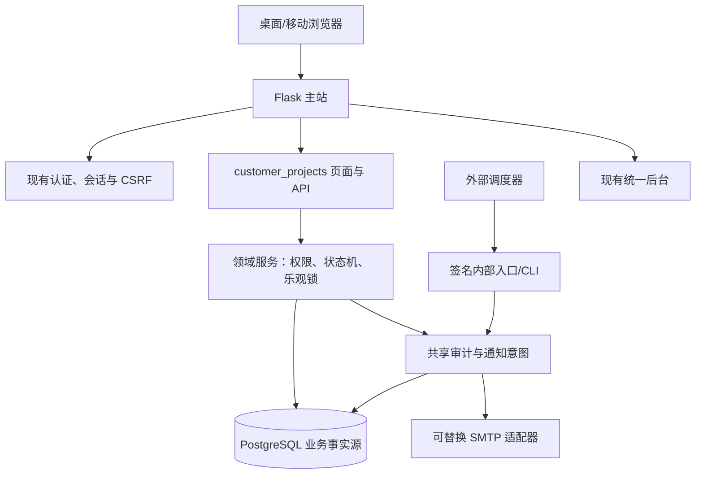
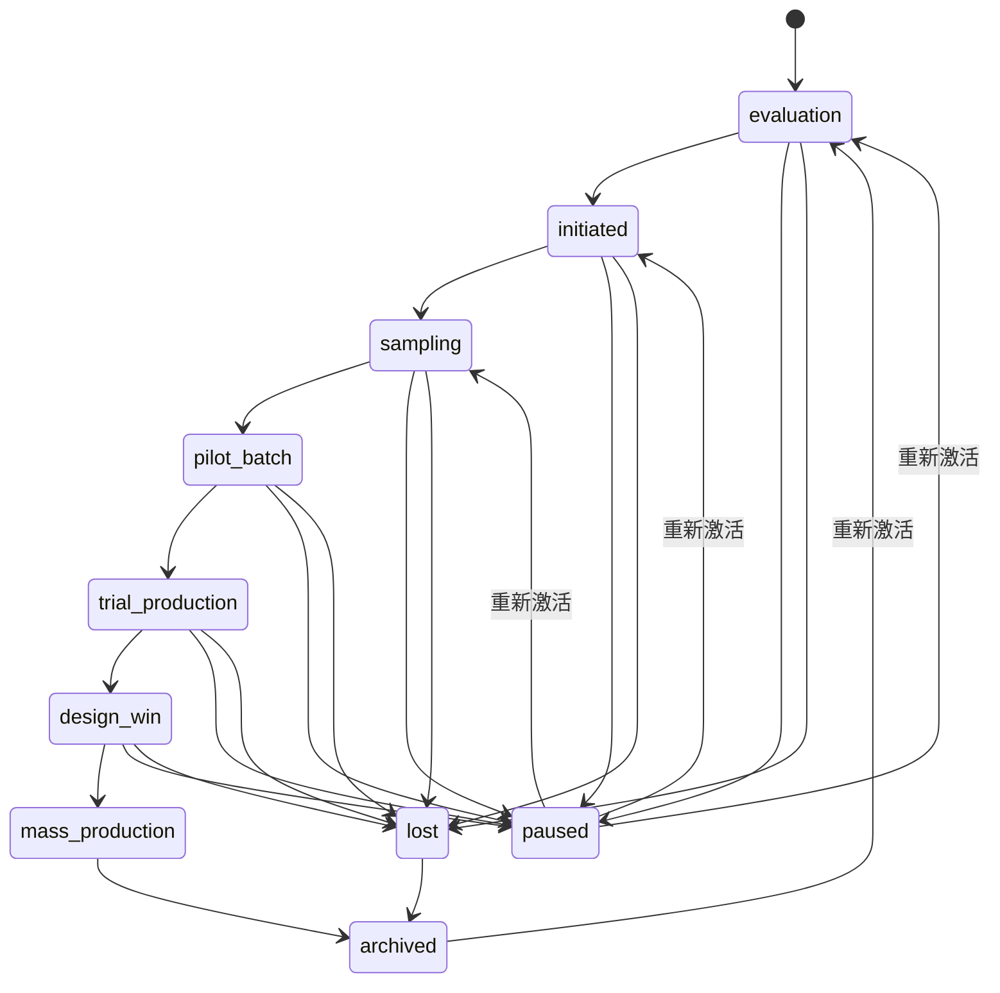

# 客户项目跟进系统 Phase 1 架构

## 实施状态

Phase 1 核心台账、Phase 2 提醒闭环、Phase 3 生命周期和 Phase 4 运营能力已在 Flask 主站中实现，所有生产开关默认关闭。推广物料按 Design In、Design Win、Evaluation、Lost 四类机会分类（Lost 仅记录竞品信息，TAM 按竞品报价估算）；项目详情实时派生 TAM/SAM/SOM，计算结果不落库。时间线支持独立留言和同组织成员提及，留言不改变业务跟进快照。真实 PostgreSQL staging、邮件域认证和生产审批尚未完成，不得将本文理解为相关能力已经上线。

## 目标与边界

本模块把电子元器件代理业务中的客户项目变成唯一、可追溯的业务事实，覆盖客户、成员、推广物料、竞争方案、跟进和生命周期。V1 不承担 ERP、库存、报价、订单、合同、群发营销或原生移动客户端职责。

本文件记录当前已实现边界；产品验收仍以[PRD](../product/customer-project-tracking-prd.md)为准，模块边界见 [ADR 0027](../adr/0027-customer-project-tracking-modular-monolith.md)，物料机会与市场规模口径见 [ADR 0032](../adr/0032-customer-project-material-opportunity-and-market-scope.md)，协作留言与输入精度见 [ADR 0033](../adr/0033-customer-project-comments-and-input-precision.md)。

## 运行边界



## 建议代码边界

```text
customer_projects/
  __init__.py
  routes.py                 # 服务端页面，薄控制器
  api.py                    # /api/v1/customer-projects
  forms.py                  # HTML 输入校验
  schemas.py                # JSON 边界校验和序列化
  models.py                 # 本领域模型
  permissions.py            # 组织与项目授权策略
  services/
    projects.py
    activities.py
    lifecycle.py
    reminders.py
  repositories/
    projects.py
  queries/
    dashboard.py
    reports.py
shared/
  organizations/            # 组织和成员
  audit/                    # 脱敏审计事件
  notifications/            # 意图、发件箱、适配器
templates/customer_projects/
static/customer_projects/
tests/customer_projects/
migrations/versions/
```

共享目录只接收已有第二个或明确计划中的消费者；Phase 1 可先通过稳定接口在同一提交内落地，避免为复用而过度抽象。

## 权限模型

访问判定顺序固定为：已登录且账号有效 → 功能开关/试点范围 → 有效组织成员 → 组织角色 → 项目成员/数据范围 → 对象未删除或具有回收站权限。平台管理员不会因 `is_admin` 自动获得所有业务内容；代查必须进入显式授权和审计路径。

| 能力 | 组织管理员 | 业务经理 | 项目成员 | 只读/审计 |
| --- | --- | --- | --- | --- |
| 创建客户/项目 | 是 | 是 | 是 | 否 |
| 编辑参与项目 | 是 | 是 | 是 | 否 |
| 编辑物料单价 | 是 | 是 | 业务、PM；FAE 否 | 否 |
| 导出可见项目 | 是 | 是 | 是 | 按数据范围 |
| 分配成员 | 是 | 是 | 依策略 | 否 |
| 确认量产/失败 | 是 | 是 | 仅发起 | 否 |
| 恢复软删除 | 是 | 项目范围内 | 否 | 否 |
| 查看审计 | 是 | 数据范围内 | 本项目可读事件 | 否 |

## 项目状态机

正常推进允许顺序前进；跨阶段必须提供原因。任何进入量产、失败、暂停、归档、重新激活或衍生的操作必须带幂等键并写阶段事件和审计。



条件校验：量产要求有效物料、日期和说明；失败要求原因和说明；暂停要求原因；重新激活要求目标阶段、原因、下一步和时间。阶段跳转保留前后状态、原因、操作者、审批者和发生时间。

## 一致性与并发

- 项目详情返回 `version`；PATCH 使用 `If-Match: \"<version>\"`，SQL 更新条件同时包含 `id`、`organization_id` 和旧版本。
- 物料和竞争方案沿用各自的 `version`，编辑与软删除都执行包含组织、未删除状态和旧版本的原子条件更新；删除必须提供原因并写审计。
- 影响行数为 0 时重新读取：不存在/不可见返回 404，版本变化返回 409；不得用后提交内容覆盖先提交内容。
- 新增有效跟进、更新项目快照、递增版本、写审计和取消旧提醒意图在同一事务完成。
- 网络发送永远不在业务事务中执行；发件箱以唯一幂等键防重复。
- 所有时间以带时区 UTC 写入，显示和邮件按组织时区，默认 `Asia/Shanghai`。

## 商务价格与汇率边界

- 主站汇率查询抽成共享服务，页面预览和客户项目领域复用同一 USD/CNY 缓存；外部汇率提供方仍被隔离在共享适配层。
- 数据库存储原始录入金额/币别、当次 USD/CNY 汇率、未税美元和含 13% 增值税人民币结果。采用快照而不是动态重算，保证历史导出和审计可复现。
- 输入 USD 时人民币结果为 `USD × USD/CNY × 1.13`；输入 CNY 时按“已含 13% 增值税人民币”解释并反算美元。只支持 USD/CNY，避免在缺少财务口径时扩张为通用报价系统。
- 价格由组织管理员、业务经理、业务或 PM 写入；FAE 对价格只读，但仍可维护单机数量。服务端权限是最终边界，模板隐藏输入框不承担授权职责。
- 汇率不可用且无最近缓存时整笔价格写入失败，不保存半成品；单机数量仍可在不带价格的新物料创建中录入。

## 读模型与容量

工作台按“今日到期、逾期、即将到期、长期未更新、待重新分配、最近更新”提供有界查询。项目、客户、物料、竞品搜索统一先做组织和权限过滤；列表默认 25 条、最大 100 条，游标由排序值和稳定 ID 构成。报表必须返回口径、数据范围、筛选时间与生成时间。

## 可观测性

指标至少覆盖请求量、错误率、延迟、409 冲突、提醒扫描心跳、待发数量、最老待发时长、发送成功率、永久失败、逾期项目和严重停滞项目。日志只写追踪 ID、不可逆组织标识、对象稳定 ID 和安全错误码，不写邮件正文、联系人完整信息或内部异常细节。

## Phase 1 已实现切片

1. Flask-Migrate/Alembic 迁移框架、默认关闭的功能开关、试点邮箱、组织/成员与默认阶段字典。
2. 客户、联系人、项目、成员、物料、竞品、活动、评论/@、阶段事件和审计模型。
3. 服务端 RBAC、状态机条件校验、事务服务、软删除/恢复、幂等键和乐观锁。
4. 工作台、项目列表/筛选、客户与联系人、新建/详情、移动端跟进、时间线留言、物料/竞品、成员和回收站页面；授权试点用户可从主站首页客户项目卡片进入。
5. `/api/v1/customer-projects` 的项目查询/创建/更新、跟进、评论、阶段、物料、竞品、软删除和恢复契约。
6. 客户评级、项目产品/年用量、物料单机数量、双币价格快照、FAE 价格隔离和审计型 Excel 导出。
7. 物料与竞争方案的完整页面/API 编辑、对象级乐观锁、带原因软删除和脱敏审计闭环；不新增迁移或外部基础设施。

本地隔离 SQLite 已完成页面人工验收：登录、组织初始化、客户/联系人、项目创建/编辑、跟进、物料/竞品、阶段流转、列表检索、工作台和 320/768/1280 响应式检查，浏览器控制台无错误。尚未完成的 Phase 1 发布验收：真实 PostgreSQL 集成、生产规模性能、备份恢复、staging 人工响应式检查和生产发布审批。功能开关必须保持关闭，直到这些门禁通过。

Phase 2 已实现扫描、组织/项目级策略、成员邮件偏好、发件箱、适配器、重试和心跳；更丰富告警仍属后续增强。

Phase 3 首切片已实现量产/失败/归档当前状态汇总、终态/暂停项目重新激活和衍生项目。重新激活复用同一聚合根并追加阶段事件；衍生创建新的聚合根，通过 `derived_from_project_id` 建立来源关系，选择性复制有效成员和资产但隔离活动/阶段历史。报表复用项目数据权限并显式声明 `updated_at` 日期口径；历史转化率仍需后续基于阶段事件单独实现。

Phase 4 已实现四个增强。共享组织工作日日历用稀疏日期覆盖表达节假日和调休工作日，未配置日期仍按周一至周五；提醒扫描在有界日期窗口内加载覆盖。受控 Excel 导入采用数据库批次状态机：上传只在内存解析，预览保存规范化行和错误，确认后复用领域创建服务，撤销只软删除创建版本未变化的项目。受控导出通过模块级组织策略限制角色、价格列、项目数和输出行数，严格复用项目可见范围，并记录筛选、文件摘要或拒绝原因。保存视图只持久化白名单筛选 JSON：个人命名空间仅本人可见，组织命名空间仅组织管理员发布和删除，同组织成员只读使用。附件和实时通知继续等待独立需求与安全评审。
