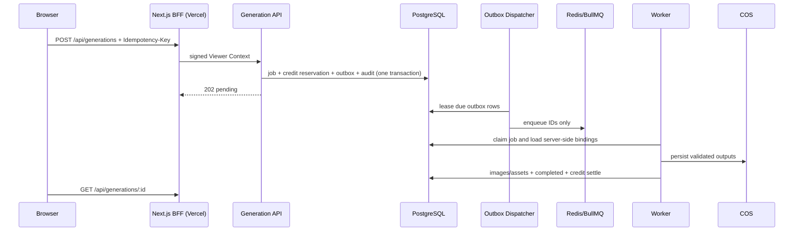

# M1：Generation 生产闭环

状态：**代码完成（含 M1.1 可用性补全与 M1.2 创作反馈闭环），待 Staging 基础设施与真实 Provider 验收**

## Golden Rule 结论

1. 会影响生产网站，因此只允许功能分支和 Vercel Preview 先验证，Production 必须另行批准。
2. 任务、积分、Outbox、Worker、Provider、存储和审计均为跨 AI 模块能力，未来视频/OCR 可复用。
3. 复用现有 Fastify、PostgreSQL、BullMQ 和 Next BFF，不新增微服务或付费基础设施。
4. API、Dispatcher、Worker 都提供单一 npm 入口和环境变量表，初学者无需编写启动脚本。
5. 浏览器不依赖 Provider，PostgreSQL 仍是事实来源，符合既有 Phase 1–10 架构。

## 调用与一致性

创建使用用户 + Idempotency-Key 唯一约束。Redis 只保存 ID；Outbox 使用 `SKIP LOCKED` 和租约。Worker 每次 Provider 调用写独立 attempt，完成时图片、资产和积分结算处于同一事务。失败或取消释放活动预留。

## 安全、成本与回滚

浏览器只访问同源 BFF；HMAC、Origin、RBAC、输入上限和错误脱敏均在服务端强制。Mock Provider 仅在显式开启且 `APP_ENV != production` 时可启动。Vercel 只承担页面和短请求，耗时任务留在常驻 Worker，图片由 COS/CDN 直出。

回滚时先隐藏 Flask 的 `ai_image.external_url`，停止 Dispatcher 并优雅关闭 Worker，再回滚 Vercel Preview 与后端镜像。`0006`/`0007` 只新增目录数据；禁用新 workflows/providers，不删除任务、账本或 COS 对象。

## M1.1 可用性补全

在 M1 主链路之上补齐四个“注册后即可使用”的缺口：

1. **首次积分**：`BILLING_SIGNUP_GRANT`（默认 10）由 Billing Service 在账户首次汇总时幂等发放，写 `ai.credit_ledger_entries`（`signup_grant`）并更新账户；`0` 表示关闭。计费逻辑仍与 Provider 解耦，未来订阅/购买共用同一账本。
2. **远端 Provider 绑定**：`0007_remote_provider_bindings.sql` 为每个活跃 workflow 增加 OpenAI / Gemini / 即梦 的默认模型绑定。Provider 行保持 disabled，管理员启用后 Selection Policy 即可路由；未启用时 `listWorkflows` 仍为空，保持 fail-closed。
3. **发布策略**：Worker 通过 `GALLERY_DEFAULT_MODERATION` 决定新图片的 `moderation_status`；`approved` 且公开时同步写 `published_at`，直接进入公共画廊与 SEO。生产默认 `pending`，保留人工审核。
4. **登录闭环**：Gallery Web 提供 `/login`、`/logout` 与 `/api/me/session`，导航头根据会话显示“登录/我的账号”；`MAVIS_AUTH_LOGIN_URL` / `MAVIS_AUTH_LOGOUT_URL` 指向 Flask，未配置时登录入口自动隐藏，避免死链。注册/登录/退出回跳统一经 Flask `_safe_next_url` 校验（只允许相对路径或 `AI_IMAGE_EXTERNAL_URL` 同源 HTTPS），Flask 提供 `flask --app app check-gallery-integration` 预检，Gallery 提供同名脚本；配置缺失时 fail closed，不泄露密钥。

## M1.2 创作反馈闭环

在 M1 主链路之上补齐"完成后即时看到结果、失败后可一键再试"：

- `GET /v1/generations`：当前用户最近任务列表，PostgreSQL keyset 分页（`created_at, id`），游标复用 Gallery 签名编解码器（scope 绑定用户，防篡改/跨用户），支持可选 `status` 过滤。
- `GenerationView` 增加 `prompt` / `negativePrompt`：只返回给任务 owner（或管理员），供前端回填重试。
- Next.js 工作台内嵌预览：完成后通过既有 Gallery BFF 获取资产 URL，不新增浏览器可访问的存储凭证；最近任务面板提供状态、取消与失败回填。

安全与回滚：列表接口仅服务 owner 查询，`limit` 1–50、`status` 白名单、游标签名校验；前端预览 URL 来自 Gallery 资产解析器（HTTPS + 主机白名单/短期签名）。回滚只需撤回本分支前端路由与 `GET /v1/generations` 路由，不涉及数据库迁移，历史任务与积分数据不受影响。

## M1.3 创作首页体验与工作流约束

针对 Preview 验收反馈补齐两类约束：

- `GenerationWorkflowView` 的 `countRange` / `sizes` 由 `workflow_versions.input_schema` 的 `minimum`/`maximum` 派生，前端不再硬编码比例与数量；`create` 在事务内按同一份 schema 拒绝越界请求，避免前端选项与服务端校验不一致。
- 工作台登录态以 `/api/me/session` 为准，计费摘要只做余额展示；服务不可用时错误文案统一本地化，游客与登录态有明确区分，首页仅保留"创作 + 预览"核心内容。

回滚：本变更不涉及数据库迁移与任务/积分数据；回滚服务端 `create` 校验与 Workflow 字段、前端工作台即可，无数据风险。
