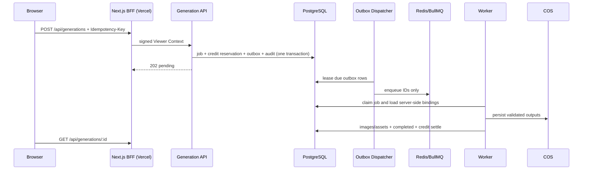

# M1：Generation 生产闭环

状态：**代码完成，待 Staging 基础设施与真实 Provider 验收**

## Golden Rule 结论

1. 会影响生产网站，因此只允许功能分支和 Vercel Preview 先验证，Production 必须另行批准。
2. 任务、积分、Outbox、Worker、Provider、存储和审计均为跨 AI 模块能力，未来视频/OCR 可复用。
3. 复用现有 Fastify、PostgreSQL、BullMQ 和 Next BFF，不新增微服务或付费基础设施。
4. API、Dispatcher、Worker 都提供单一 npm 入口和环境变量表，初学者无需编写启动脚本。
5. 浏览器不依赖 Provider，PostgreSQL 仍是事实来源，符合既有 Phase 1–10 架构。

## 调用与一致性

创建使用用户 + Idempotency-Key 唯一约束。Redis 只保存 ID；Outbox 使用 `SKIP LOCKED` 和租约。Worker 每次 Provider 调用写独立 attempt，完成时图片、资产和积分结算处于同一事务。失败或取消释放活动预留。

## 安全、成本与回滚

浏览器只访问同源 BFF；HMAC、Origin、RBAC、输入上限和错误脱敏均在服务端强制。Mock Provider 仅在显式开启且 `APP_ENV != production` 时可启动。Vercel 只承担页面和短请求，耗时任务留在常驻 Worker，图片由 COS/CDN 直出。

回滚时先隐藏 Flask 的 `ai_image.external_url`，停止 Dispatcher 并优雅关闭 Worker，再回滚 Vercel Preview 与后端镜像。`0006` 只新增目录数据；禁用新 workflows/providers，不删除任务、账本或 COS 对象。
