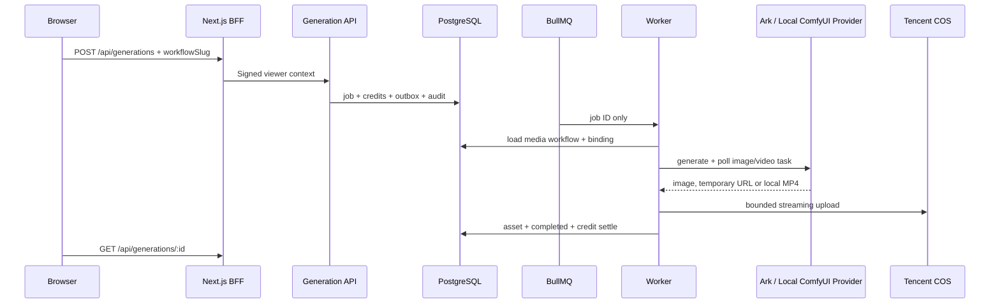

# M4：Gallery 图片与视频生成架构

状态：本机 ComfyUI 生图/生视频闭环已完成开发环境验收；生产仍等待 Staging 成本、容量和内容安全验收。

## 边界

图片和视频复用同一 Generation API、PostgreSQL job/outbox、BullMQ、Worker、Provider Registry、积分账本、审计和 COS。浏览器只提交 `workflowSlug` 与工作流允许的参数，不能选择 Provider、模型、Endpoint 或存储。

`ai.workflows.media_type` 决定任务输出类型。图片继续投影到 `ai.images` / `ai.image_assets`，保持 Gallery 互动、审核和 SEO 不变；视频输出写入 owner-scoped `ai.generation_assets`，本阶段不进入公共 Gallery feed。

## Provider 与持久化

- `GenerationProvider` 是图片/视频共用的执行契约；旧 `ImageProvider` 名称只保留为源码兼容别名。
- Adapter 必须声明 `mediaTypes` 和 generation modes；路由层同时检查工作流 binding、Provider 状态、积分档位和能力。
- Ark 视频 Adapter 使用官方异步创建、查询、取消接口；模型留在数据库 binding，API Key 只在 Worker 环境。
- ComfyUI Adapter 仅由 Worker 调用，支持 `SaveImage` 与 Video Helper Suite MP4；模型、工作流和采样参数留在服务端 binding，浏览器不能覆盖。
- 本机 ComfyUI 只监听 loopback；开发链路、依赖版本与完整验收步骤见[本地 ComfyUI 联调指南](../deployment/gallery-local-comfyui.md)。
- 临时视频只允许 HTTPS，MIME 白名单为 MP4/WebM/QuickTime，默认最大 200 MiB，流式落盘后上传 COS。
- 上传成功前任务不得完成；部分上传失败会补偿删除已上传对象。

## 取消、成本和安全

排队中的视频任务可取消。进入 `running` 后，因上游不保证可取消，用户 API 不接受取消，避免积分退款与供应商继续计费同时发生。视频工作流、模型、Provider 默认 fail-closed；迁移完成不等于上线。

视频默认 5 秒、单输出、会员积分、私有 Prompt/作品。允许时长由 workflow input schema 白名单控制，前端值与服务端再次校验。公开视频需要先补齐封面、转码、审核、播放统计和 SEO 决策。

决策记录见 [ADR-0025](../adr/0025-gallery-media-generation-and-ark-video.md) 与 [ADR-0026](../adr/0026-local-comfyui-media-provider-boundary.md)，API 见 [OpenAPI](../api/openapi-generation-v1.yaml)。
