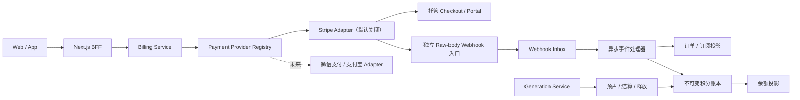
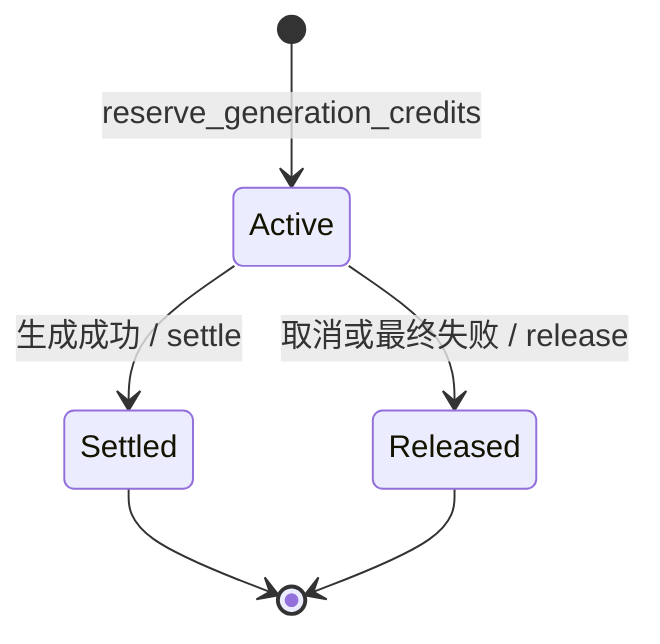

# Phase 10 — 支付、积分与会员体系

状态：已实现，待业务方配置真实商品与商户主体后启用收款。

## 结论

Phase 10 将三类状态彻底分离：

- Payment Provider 只创建托管结账/订阅管理会话，并把已签名事件送入系统。
- Billing Service 管理订单、会员投影、Webhook 收件箱、退款冲正与支付审计。
- Credit Ledger 是生成额度的唯一事实来源，Generation Service 只通过原子预占、结算、释放函数改变额度。

前端只调用 `/api/billing/*`，永远不知道 Stripe、微信支付或支付宝中的哪一家完成交易。Stripe 是首个实现的 Adapter，但运行时默认关闭。Stripe 当前的全球可用地区列表不包含中国大陆商户开户，因此只有在运营主体位于其支持地区并完成合规审核后才可开启；中国大陆主体应新增本地支付 Adapter，不能伪造或借用商户主体。

## 架构

## 数据模型

`0005_billing_credits_memberships.sql` 新增：

- `billing_plans`：内部商品目录。真实金额、币种和 Provider Price ID 由运营发布，不写死在代码里。
- `billing_customers`：内部用户与外部 Customer ID 的一对一映射。
- `payment_orders`：一次性积分包或订阅 Checkout 的幂等订单。
- `subscriptions`：会员访问状态的内部投影，按 Provider event time 抵抗乱序事件。
- `payment_webhook_events`：先验签、再持久化、后异步处理的事件收件箱。
- `credit_accounts`：可用、预占、累计获得和累计消耗的快速余额投影。
- `credit_ledger_entries`：不可 UPDATE/DELETE 的审计流水。
- `credit_reservations`：每个生成任务唯一的额度预占记录。

金额与积分采用不同单位：支付金额是 `bigint amount_minor`（货币最小单位），积分是 PostgreSQL `numeric(18,4)` 并以字符串穿过 JSON/TypeScript，禁止用 JavaScript 浮点数记账。

## 生成积分状态机

- 预占在单个数据库事务中锁定账户，余额不足时失败，不允许并发超扣。
- 重复预占同一 `generation_job_id` 返回现状；用户或金额不一致则冲突。
- 成功结算只消耗最终用户价格，释放估算差额；Provider 实际成本单独进入成本审计，不直接作为用户积分浮动价格。
- 失败与取消释放全部预占；同一预占不能既结算又释放。

## Webhook 处理

1. 独立端口保留原始 `application/json` 字节，限制为 256 KiB。
2. Adapter 使用官方 SDK 验证签名与时间容差。
3. 只保存业务需要的标准化字段和原始内容 SHA-256，不保存完整支付对象或银行卡信息。
4. `(payment_provider, external_event_id)` 唯一约束去重并立即返回 `202`。
5. Worker 使用 `FOR UPDATE SKIP LOCKED` 领取，失败指数退避，停滞锁 10 分钟后可回收。
6. `invoice.paid` 幂等发放订阅积分；订阅事件按 `event_created_at` 忽略旧事件。
7. 积分包退款按累计退款比例冲正。用户已花完积分时允许可用余额为负，后续生成会被余额检查阻止，账务事实不会被抹掉。

## API 与页面

- `GET /v1/billing/summary`：公开方案；登录用户附带余额、会员和最近流水。
- `POST /v1/billing/checkout`：内部方案 slug + 客户端幂等键，返回托管 HTTPS URL。
- `POST /v1/billing/portal`：返回外部订阅管理 URL。
- `POST /v1/billing/webhooks/:provider`：仅部署在支付入口，不经前端 BFF。
- `/pricing`：公开方案、结账入口与无真实价格时的安全占位状态。
- `/billing`：账户余额、会员状态、托管 Portal 与最近 30 条流水。

托管 URL 只在订单有效期内保存，Checkout 完成后清空；密钥、Provider 错误体和完整 Webhook Payload 不返回浏览器。

## 验证结果

- Generation Service TypeScript typecheck：通过。
- 全量单元/契约测试：53/53 通过，其中 Phase 10 新增 5 项。
- PostgreSQL 18 从 0001 到 0005 全量迁移：通过。
- Phase 10 PostgreSQL 集成测试：2/2 通过（幂等预占/结算、不可变流水）。
- Gallery Web ESLint：通过。
- Next.js 16 production build：通过，`/pricing`、`/billing` 和 3 个 BFF Route Handler 均为动态路由。
- 浏览器 QA：桌面 1440×900 与移动 390×844 网格、无水平溢出、访客账单状态和控制台错误检查通过。

