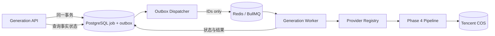

# Phase 5：Redis / BullMQ 生产队列

状态：**完成并通过本地类型、契约及故障语义测试**  
范围：在 Generation Service 与 Phase 4 Provider 管线之间新增持久队列；不修改前端和 `ImageProvider` 契约。

## 架构结果

Phase 5 将同步的“提交并等待生成”改为可靠的异步任务：PostgreSQL 是业务状态和审计的事实来源，Redis/BullMQ 负责调度、延迟重试、并发控制和短期运行状态。Redis 不保存 prompt、workflow JSON、Provider 配置或凭证。



## 可靠提交

API 创建 `generation_jobs` 时，在同一 PostgreSQL 事务内写入 `generation.requested` outbox event。Dispatcher 使用已有 `ai.outbox_events` 领取批次，成功 `queue.add()` 后标记 `published_at`；Redis 不可用时按指数退避更新 `available_at`。这避免数据库提交成功但 Redis 写入丢失的双写窗口。

BullMQ 的 `jobId` 固定为 generation UUID。重复发布同一 outbox event 或 API 重试不会创建第二个仍被 Redis 保留的任务；即使 Redis 完成记录按保留策略被清除，worker 仍会先从数据库原子 `claim`，已完成 generation 会直接返回历史结果。

## 队列载荷

唯一允许的 schema v1：

```json
{
  "schemaVersion": 1,
  "jobId": "generation-id",
  "requestId": "request-id",
  "enqueuedAt": "ISO-8601 timestamp"
}
```

出现额外字段会被拒绝，所以 prompt、negative prompt、Provider、模型、内部路径和密钥无法意外进入 Redis 明文数据。

## Worker 执行

1. worker 取得 BullMQ job，使用 `attemptsStarted` 作为数据库 attempt 序号，包含 stalled 后的重新执行。
2. `GenerationJobRepository.claim()` 原子检查 cancelled/completed，并从 PostgreSQL 加载 request 和 server-side bindings。
3. Phase 3 Selection Policy 选择 Provider，Phase 4 Pipeline 执行生成与 COS 持久化。
4. 成功后先写 PostgreSQL，再返回精简 BullMQ result；失败按 `ProviderError.retryable` 决定是否指数退避。
5. 非重试错误和用户取消转为 BullMQ `UnrecoverableError`，不会消耗剩余 attempts。

## At-least-once 与幂等

BullMQ 可能在 worker 崩溃或 lock 丢失后重新执行任务，因此不能假设 exactly-once：

- 数据库 `claim` 对 completed/cancelled 状态短路。
- generation attempt 使用 job + attempt 序号唯一约束。
- COS key 使用 `images/jobs/{jobId}/{outputIndex}.{ext}`，重放会覆盖同一对象，而不是生成孤儿副本。
- 多图上传中途失败执行补偿删除。
- outbox 发布与 queue add 都允许重复，业务结果仍由 PostgreSQL 唯一约束收敛。

## 状态映射

| BullMQ | 对外状态 | PostgreSQL |
| --- | --- | --- |
| `waiting/prioritized` | `waiting` | `pending` |
| `delayed` | `delayed` | `pending` + retry metadata |
| `active` | `running` | `running` |
| `completed` | `completed` | `completed` |
| `failed` 且仍可重试 | `delayed/waiting` | `pending` |
| 最终 failed | `failed` | `failed` |
| remove/cancel signal | `cancelled` | `cancelled` |

面向前端的状态仍从 PostgreSQL 查询；BullMQ 状态只用于运维诊断，避免 Redis 清理或故障改变业务 API 结果。

## 跨进程取消

- waiting/delayed job：直接从队列删除；API 事务先写 `cancel_requested_at/status`。
- active job：API producer 向专用 Redis channel 发布严格 schema 的取消命令。
- 对应 worker 调用 `cancelJob()`，把 `AbortSignal` 传递到 Pipeline。
- Pipeline 中止 HTTP/轮询，并在取得 external id 后调用 Provider `cancel()`；ComfyUI 的全局 `/interrupt` 仍默认关闭。

## 恢复与停机

- worker 开启 lock renewal 和 stalled 检查；lock renewal 失败会立即 abort 本地执行，任务由 BullMQ stalled 机制恢复。
- worker 收到停机后停止订阅取消事件并等待活动任务完成；超过 grace period 才取消活动任务并强制关闭。
- API Redis 连接 fail-fast；worker Redis 连接无限重连，分别符合交互请求和后台消费的不同需求。
- BullMQ 2+ 不需要额外 `QueueScheduler`，本项目不部署已废弃组件。

## 可观测性

`GenerationQueueObservability` 输出 Redis latency、worker 数、waiting/active/delayed/completed/failed 数量。日志包含 queue job id、generation id、attempt、stalled、lock renewal、retry delay、取消结果和安全错误码，不包含 prompt 或 Redis URL。

建议告警：无 worker、waiting 持续增长、oldest job age、stalled/lock renewal、最终失败率、Redis latency/内存、outbox backlog、取消延迟和 COS 补偿失败。

## 版本与依赖

- `bullmq` 6.0.5
- `ioredis` 6.0.0
- 生产推荐腾讯云分布式缓存数据库兼容 Redis 7.0；本地 compose 使用 Redis 7.4。

配置见[Phase 5 配置手册](../deployment/phase-5-configuration.md)，部署见[Phase 5 部署手册](../deployment/phase-5-deployment.md)，决策见 [ADR-0005](../adr/0005-phase-5-redis-bullmq-queue.md)。
