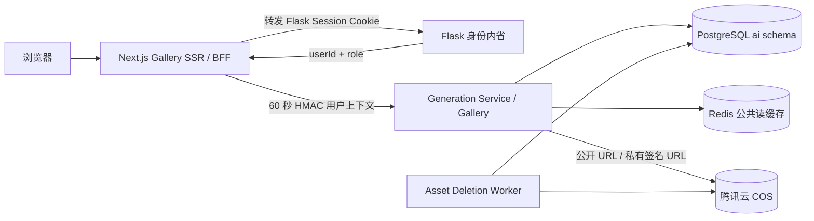

# AI Image Platform — Phase 6 Gallery 系统

状态：**已实现并通过自动化与真实 PostgreSQL 集成验证**  
默认对象存储：**腾讯云 COS**  
页面：Next.js App Router；业务 API：Generation Service 内部 Gallery 模块

## 1. 完成范围

Phase 6 将已持久化的生成结果变成可浏览、可授权、可互动和可删除的社区内容：

- 公开 Gallery、图片详情、我的图片、收藏页面；
- 瀑布流、等宽网格、紧凑布局和移动端适配；
- PostgreSQL keyset cursor 分页、标题/描述/公开 Prompt 搜索、标签/工作流/方向筛选；
- Prompt 隐私、私有图片、owner/admin 删除权限；
- 收藏、点赞、下载日志及数据库级原子计数；
- Redis 短 TTL 公共读缓存和版本化失效；
- 腾讯云 COS 公共 URL allowlist 与私有图片短时签名 URL；
- 软删除、延迟物理删除、指数退避和 stalled task 恢复；
- Flask Session → Next.js BFF → Generation Service 的最小身份链路；
- 结构化日志、审计、限流、同源写保护和安全错误映射。

SEO metadata、OpenGraph、JSON-LD、canonical 和 sitemap 仍属于 Phase 7。本阶段详情页只提供基础标题，不提前实现 SEO 策略。

## 2. 边界与调用链

浏览器只调用 Next.js 同源 `/api/*`。它看不到 Generation Service 地址、数据库、Redis、COS 凭证或 HMAC 密钥。Next.js 不直连 PostgreSQL，所有权限与业务事务继续集中在 Generation Service。

## 3. 数据库增量

迁移：[0002_gallery_system.sql](../../services/generation-service/database/migrations/0002_gallery_system.sql)

新增：

- `ai.user_profiles`：公开展示名和头像；不把用户邮箱暴露给 Gallery。
- `ai.asset_deletion_tasks`：记录延迟对象删除、attempt、锁、错误和完成时间。
- feed、个人作品、收藏、点赞的混合降序 keyset 索引。
- likes/favorites/download_logs 的数据库触发器，确保计数在任何写入路径下保持一致。

`ai.images.deleted_at` 是下架事实。删除 API 与 deletion task 在同一事务提交；图片立即从读路径消失，COS 删除失败不会把业务状态回滚成公开。

## 4. 权限与隐私

| 操作 | Guest | Registered User | Admin |
| --- | --- | --- | --- |
| 浏览 `public + approved + not deleted` | 允许 | 允许 | 允许 |
| 查看 private 图片 | 拒绝 | 仅 owner | 允许 |
| 查看 hidden Prompt | 拒绝 | 仅 owner | 允许 |
| 我的图片/收藏 | 拒绝 | 仅本人 | 允许自己的集合 |
| 点赞/收藏 | 拒绝 | 公开且已审核图片 | 公开且已审核图片 |
| 删除图片 | 拒绝 | 仅 owner | 任意图片 |
| 下载 | 公开图片允许 | 公开或 owner | 允许 |

不可见图片统一返回 404，减少通过 ID/slug 探测私有内容的侧信道。Prompt 搜索只匹配 `prompt_visibility = public` 的 Prompt；隐藏 Prompt 不进入公开搜索。

## 5. API 契约

所有 `/v1/*` 路由要求 BFF 签名用户上下文，即使 Guest 也必须由可信 BFF 签发。

| 方法 | 路径 | 说明 |
| --- | --- | --- |
| `GET` | `/v1/gallery` | 公开 feed；`cursor/limit/q/tag/workflow/orientation` |
| `GET` | `/v1/gallery/:slug` | viewer-aware 详情和 Prompt 过滤 |
| `GET` | `/v1/me/images` | 当前用户图片 |
| `GET` | `/v1/me/favorites` | 当前用户可访问收藏 |
| `PUT/DELETE` | `/v1/images/:id/favorite` | 幂等收藏/取消 |
| `PUT/DELETE` | `/v1/images/:id/like` | 幂等点赞/取消 |
| `POST` | `/v1/images/:id/download` | 记录下载并返回安全 URL |
| `DELETE` | `/v1/images/:id` | owner/admin 软删除 |

游标包含 feed scope、时间和 UUID，并使用 HMAC 防篡改。不同筛选条件、个人 feed 和收藏 feed 的 cursor 不能交叉使用。

## 6. 缓存策略

- 只缓存 Guest 的公开 feed 和公开详情；认证请求不缓存 viewer flags。
- 默认 TTL 30 秒。
- key 带 `public-feed` 或 `detail` namespace version。
- 点赞、收藏、下载和删除后 bump version，旧 key 自然过期，无需扫描删除。
- Redis 故障时可使用 No-op cache，PostgreSQL 仍是事实来源。

Redis 不缓存私有图片、隐藏 Prompt、Flask Session 或 COS 凭证。

## 7. 删除与 COS 生命周期

1. API 在事务中检查 owner/admin、设置 `deleted_at`、创建/重置 deletion task、写 audit log。
2. Gallery 和详情查询立即排除软删除图片。
3. retention 到期后 worker 使用 `FOR UPDATE SKIP LOCKED` 领取任务。
4. worker 按 `storage_provider` 选择 Storage Adapter 并删除全部对象。
5. 全部删除后移除 `image_assets` 元数据并标记 task completed。
6. 失败只记录安全错误码，指数退避重试；运行锁超过 15 分钟可被其他 worker 重新领取。

默认 retention 为 24 小时，为误删处理和快速回滚留出窗口。

## 8. 实现位置

- Gallery 领域与 API：`services/generation-service/src/gallery/`
- PostgreSQL migration：`services/generation-service/database/migrations/0002_gallery_system.sql`
- Next.js Gallery：`apps/gallery-web/`
- Flask 身份桥：`auth/routes.py` 的 `/internal/gallery/session`
- Phase 6 测试：`services/generation-service/test/phase6-gallery*.ts`、`tests/test_gallery_auth_bridge.py`

## 9. 验收结果

- Generation Service TypeScript 类型检查通过。
- Provider、ComfyUI、Queue、Gallery：35 个常规测试通过。
- PostgreSQL 18：两次迁移完整提交，真实权限/Prompt/互动/删除集成测试通过。
- Next.js ESLint、TypeScript、production build 通过。
- Flask 身份桥和 schema contract：14 个相关测试通过。
- BFF 端到端：Guest feed 200、Guest 收藏 401、跨站写请求 403。
- npm audit：0 个已知漏洞。

决策记录：[ADR-0006](../adr/0006-phase-6-gallery-service-and-next-bff.md)。
