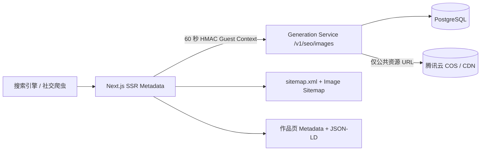

# AI Image Platform — Phase 7 SEO 页面

状态：**已实现并通过自动化、真实 PostgreSQL 与 HTTP 集成验证**  
公开域名：`GALLERY_PUBLIC_ORIGIN`，缺省为 `https://www.mindfulpenpal.com`  
适用范围：公开且审核通过、未删除的 Gallery 图片

## 1. 完成范围

- 作品详情动态 `title`、`description`、canonical、Open Graph 和 Twitter Card；
- 每个可索引作品使用真实 COS/CDN 图片作为社交预览；
- `ImageObject` 与 `BreadcrumbList` JSON-LD；
- Gallery 首页 `CollectionPage` JSON-LD；
- 图片 Sitemap，单文件覆盖协议上限 50,000 个公开作品；
- `robots.txt` 允许公开 Gallery，禁止 API、个人图片、收藏和后台路径；
- 搜索、筛选和游标参数页统一 canonical 到 `/gallery` 并设置 `noindex,follow`；
- 私有图片、未审核图片、已删除图片和错误页不索引；
- 个人图片、收藏页面显式 `noindex,nofollow`；
- 品牌级 Open Graph/Twitter 默认分享图和语义化 404 页面。

## 2. 数据流与信任边界

SEO 专用接口只返回 `slug`、`publishedAt`、`assetUrl`。它不返回 Prompt、negative prompt、Provider、模型、用户 ID、收藏状态或任何私有字段。接口仍要求可信 Next.js BFF 的 HMAC 上下文，浏览器不能直接调用内部服务。

## 3. 索引规则

| 页面/状态 | Index | Follow | Canonical |
| --- | --- | --- | --- |
| `/gallery` | 是 | 是 | `/gallery` |
| `/gallery/:slug` 且 public + approved | 是 | 是 | 当前 slug |
| `/gallery?q=...`、筛选或 cursor | 否 | 是 | `/gallery` |
| 私有、待审核、拒绝或已删除图片 | 否 | 否 | 无 |
| `/my-images`、`/favorites` | 否 | 否 | 无 |
| `/api/*`、`/admin/*` | robots 禁止 | — | 无 |

作品 metadata 和 JSON-LD 始终使用 Guest 视角读取。即使 owner/admin 正在查看隐藏 Prompt，该字段也不会进入 `<head>` 或结构化数据。

## 4. Sitemap 策略

Generation Service 使用现有 `(published_at DESC, id DESC)` 部分索引和 HMAC 签名 keyset cursor，每批最多输出 1,000 条最小记录。Next.js 逐批读取，单 Sitemap 最多 50,000 条，并为每个 URL 写入：

- canonical 作品 URL；
- `lastModified = publishedAt`；
- 真实公共图片 URL；
- `changeFrequency = monthly`；
- `priority = 0.8`。

Sitemap 在运行时生成，并通过 `Cache-Control: s-maxage=3600, stale-while-revalidate=86400` 在 CDN/反向代理缓存。这样生产构建不依赖数据库，同时正常抓取不会持续访问服务。Generation Service 临时不可用时，仍返回 `/gallery` 基础条目，避免整个 Sitemap 路由 500。达到 50,000 个公开作品前，应在后续容量阶段改为分片 Sitemap。

## 5. 结构化数据安全

- JSON-LD 使用 `JSON.stringify(...).replace(/</g, "\\u003c")`，阻断 `</script>` 注入；
- 标题和描述折叠空白并限制长度；
- 隐藏 Prompt 和 Provider 路由不参与 SEO 文案；
- 图片 URL 继续经过 Phase 6 的 HTTPS hostname allowlist；
- public origin 仅接受 HTTPS，开发环境只额外允许 loopback HTTP；
- 不生成虚构统计、作者资料或标签。

## 6. 实现位置

- SEO 数据接口：`services/generation-service/src/gallery/`
- SEO helper：`apps/gallery-web/src/lib/seo.ts`
- 作品动态 metadata/JSON-LD：`apps/gallery-web/src/app/gallery/[slug]/page.tsx`
- Sitemap：`apps/gallery-web/src/app/sitemap.xml/route.ts`
- Robots：`apps/gallery-web/src/app/robots.ts`
- 社交分享图：`apps/gallery-web/src/app/opengraph-image.tsx`
- 测试：`services/generation-service/test/phase7-seo*.ts`、`apps/gallery-web/test/seo.test.ts`

## 7. 部署验收

1. 生产环境设置 `GALLERY_PUBLIC_ORIGIN=https://www.mindfulpenpal.com`。
2. 先部署包含 `/v1/seo/images` 的 Generation Service，再部署 Next.js。
3. 验证 `/robots.txt`、`/sitemap.xml`、公开作品 `<head>` 和 JSON-LD。
4. 使用 Google Rich Results Test 或 Schema Markup Validator 检查线上公开作品。
5. 在搜索平台提交 `/sitemap.xml`，监控抓取错误和被排除原因。

## 8. 验证结果

- Generation Service TypeScript 类型检查通过；Phase 3–7 常规测试 37/37 通过。
- Phase 7 前端 SEO 测试 2/2 通过，覆盖 canonical、JSON-LD 转义、Prompt/Provider 隔离和 origin 校验。
- PostgreSQL 18 真实迁移与 SEO feed 集成测试通过，仅导出 public + approved 图片。
- Next.js ESLint、TypeScript 与 production build 通过；`sitemap.xml` 为运行时路由，构建不依赖数据库。
- HTTP 烟测通过：robots、Image Sitemap、canonical、OG、Twitter、JSON-LD、参数页/个人页 noindex 和品牌分享图均返回正确。
- 1440px 桌面与 390px 移动端浏览器验证通过，无横向溢出。
- ADR 完整性及相关 Python 合约测试 15/15 通过。

决策记录：[ADR-0007](../adr/0007-phase-7-public-image-seo.md)。
