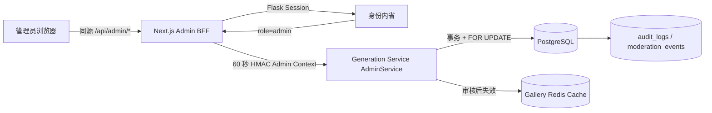

# AI Image Platform — Phase 8 管理后台

状态：**已实现并通过自动化、真实 PostgreSQL、BFF 与浏览器验证**  
页面：Next.js `/admin`  
业务边界：Generation Service `AdminService`

## 1. 完成范围

- 管理总览：待审核、公开作品、24 小时任务/失败、活跃 Provider、启用 Workflow；
- 人工审核队列：批准、拒绝和管理员删除；
- Provider 管理：启用/禁用、路由优先级、健康与凭证配置状态；
- Workflow 管理：启用/禁用、展示排序、active version 和可用 binding 数量；
- 最近生成任务：状态、工作流、实际 Provider、成本和时间，不返回 Prompt；
- 最近管理审计：操作、资源和时间，不回传 audit metadata；
- Next.js 同源 BFF、前后端双层 Admin RBAC、写限流；
- `updatedAt` 乐观并发，陈旧写入返回 409；
- 管理页面及 API 禁止搜索引擎索引。

本阶段不允许在后台输入 Provider API key，不创建/编辑 ComfyUI workflow JSON，也不实现用户封禁、支付或会员管理。这些能力需要独立的密钥发布、版本化工作流或 Phase 10 权限模型。

## 2. 调用链

Next.js layout 先过滤非 Admin，改善页面体验；Generation Service 再独立校验签名身份和 `role=admin`。任何客户端绕过页面直接调用 API 都会在业务服务层被拒绝。

## 3. API 契约

| 方法 | 路径 | 说明 |
| --- | --- | --- |
| `GET` | `/v1/admin/dashboard` | 总览、审核、Provider、Workflow、任务与审计读模型 |
| `PATCH` | `/v1/admin/images/:id/moderation` | `approved/rejected` 人工审核 |
| `PATCH` | `/v1/admin/providers/:id` | `active/disabled` 与优先级 |
| `PATCH` | `/v1/admin/workflows/:id` | enabled 与 sort order |
| `DELETE` | `/v1/images/:id` | 复用 Phase 6 owner/admin 软删除流程 |

读接口每分钟最多 60 次，管理写入每分钟最多 20 次。Next.js BFF 同时检查 Origin；请求体最多 16 KiB，未知字段直接拒绝。

## 4. 审核状态事务

1. `SELECT ... FOR UPDATE` 锁定图片并读取 `updated_at`。
2. 与客户端 `expectedUpdatedAt` 比较；不一致返回 409。
3. 批准时设置 `moderation_status=approved`；公开图片首次批准时写 `published_at`。
4. 拒绝时设置 `moderation_status=rejected` 并清空 `published_at`。
5. 同一事务写入 `moderation_events(stage=manual)` 和 `audit_logs`。
6. 提交后失效 Gallery 公开 feed 与详情缓存。

审核队列只显示 `pending/manual_review + not deleted` 图片。缩略图通过管理员授权的短时 COS 签名 URL 返回，不把对象存储凭证交给浏览器。

## 5. Provider 与 Workflow 管理

- Provider API 永远不返回 `secret_ref`，只返回 `secretConfigured: boolean`。
- 后台只能切换 `active/disabled`；`degraded` 由健康检查产生，不作为人工目标状态。
- Provider 优先级只修改数据库策略输入，不让前端指定单次生成 Provider。
- Workflow definition/version 继续不可变；后台只控制公开 workflow 的 enabled 与排序。
- active version 和 binding count 是只读诊断，避免后台绕过发布流程直接改 JSON。

## 6. 数据库增量

迁移：[0003_admin_console.sql](../../services/generation-service/database/migrations/0003_admin_console.sql)

- `ix_ai_images_moderation_created`：审核状态 + 创建时间部分索引；
- `ix_ai_audit_created`：最近管理操作查询索引。

核心管理表和 `updated_at` trigger 已由 Phase 2 建立，因此本阶段不新增业务表。

## 7. 安全与隐私

- 浏览器不能自报 Admin；角色来自 Flask Session 内省和 HMAC 签名上下文。
- 非 Admin 在 Next 页面层返回 404，内部 API 返回 401/403。
- Prompt、negative prompt、Provider `secret_ref`、audit metadata、签名 URL查询串不进入后台读模型或日志。
- 每次审核和配置变更记录 request ID、管理员、资源、旧值和新值。
- 删除仍使用 Phase 6 软删除 + 延迟 COS 清理，保留误操作恢复窗口。
- 所有后台页面 `noindex,nofollow`，robots 同时禁止 `/admin/` 和 `/api/`。

## 8. 实现位置

- Admin 领域：`services/generation-service/src/admin/`
- 数据库迁移：`services/generation-service/database/migrations/0003_admin_console.sql`
- Fastify Admin routes：`services/generation-service/src/gallery/http-server.ts`
- Next.js 页面：`apps/gallery-web/src/app/admin/`
- BFF routes：`apps/gallery-web/src/app/api/admin/`
- 交互组件：`apps/gallery-web/src/components/admin-console.tsx`
- 测试：`services/generation-service/test/phase8-admin*.ts`

## 9. 验证结果

- Generation Service 类型检查通过；Phase 3–8 常规测试 40/40 通过。
- PostgreSQL 18 完整执行 migration 0001–0003；审核、发布、409 冲突、Provider/Workflow 更新、moderation event 与 audit transaction 验证通过。
- Next.js ESLint、TypeScript 与 production build 通过，Admin 页面和四个 BFF route 均为动态服务端路由。
- BFF 烟测：Admin 页面 200、dashboard 200、合法 PATCH 200、跨站 PATCH 403、陈旧 PATCH 409。
- Provider 只返回凭证布尔状态，真实 `secret_ref` 未出现在 API、SSR HTML 或浏览器页面。
- 1440px 桌面和 390px 移动端验证通过，六项指标和五个管理视图可访问，无横向页面溢出。

决策记录：[ADR-0008](../adr/0008-phase-8-admin-control-plane.md)。
