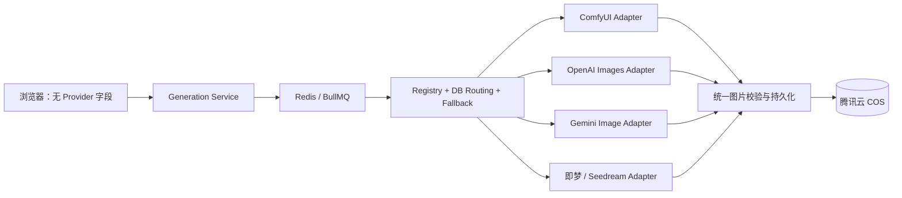

# AI Image Platform — Phase 9 多 Provider

状态：**已实现并通过契约、回归与真实 PostgreSQL 验证**  
范围：OpenAI Images、Google Gemini Image、火山引擎即梦/Seedream、Provider Model Registry 与安全故障转移。

## 1. 架构结果

Phase 9 没有改变浏览器生成契约，也没有让 Generation Service 依赖任何供应商 SDK 类型。三个新 Adapter 继续实现 Phase 3 的 `ImageProvider`；模型、Provider 状态、路由优先级和 binding 全部来自服务端。

供应商响应不会直接成为 Gallery URL。远程 API Adapter 强制获取 Base64，校验图片格式、尺寸和响应体上限，再交由现有 `ImagePersistenceService` 上传 COS。

## 2. Provider 能力矩阵

| Provider code | Adapter | Phase 9 模式 | 输出 | Seed | 状态/取消 |
| --- | --- | --- | --- | --- | --- |
| `comfyui` | `ComfyUIProvider` | text/image-to-image | 临时文件 | 支持 | 异步轮询、定向取消 |
| `openai` | `OpenAIImageProvider` | text-to-image | Base64 | 不支持 | 同步；不可轮询/取消 |
| `gemini` | `GeminiImageProvider` | text-to-image | Base64 inline data | 不支持 | 同步；不可轮询/取消 |
| `jimeng` | `JimengImageProvider` | text-to-image | Base64 | 支持 | 同步；不可轮询/取消 |

远程 Provider 在本阶段声明 `maxOutputs=1`。多图请求仍可路由给支持该能力的 ComfyUI；不会假装第三方模型能稳定返回指定数量。后续如官方批处理契约稳定，可通过 capability 和 binding 单独启用。

## 3. 官方 API 映射

- OpenAI 使用 `POST /v1/images/generations`，模型由 binding 指定；尺寸必须满足 GPT Image 2 的 16 像素倍数、像素总量和长宽比约束。当前模型依据：[OpenAI Image generation](https://developers.openai.com/api/docs/guides/image-generation) 与 [GPT Image 2](https://developers.openai.com/api/docs/models/gpt-image-2)。
- Gemini 使用 `models/{model}:generateContent`，只请求 `IMAGE` modality，并把业务宽高映射为官方 aspect ratio 和 `512/1K/2K/4K` image size。依据：[Gemini image generation](https://ai.google.dev/gemini-api/docs/generate-content/image-generation)。
- 即梦使用火山方舟 `POST /api/v3/images/generations`，关闭组图和 streaming，指定 `b64_json`；Seed、guidance scale、watermark 和 prompt optimize 均在 Adapter 白名单内。依据：[火山方舟 ImageGenerations](https://api.volcengine.com/api-docs/view?action=ImageGenerations&serviceCode=ark&version=2024-01-01)。

代码不保存“最新模型”常量。migration 只建立首批可审核的模型目录；实际 workflow binding 必须绑定明确 model code，可按新 migration 发布新模型并回滚旧模型。

## 4. 路由与故障转移

候选顺序保持 Phase 3 规则：

1. 数据库 Provider 状态（active 优于 degraded，disabled 排除）；
2. workflow binding priority；
3. 数据库 Provider priority；
4. binding estimated cost；
5. Provider code 稳定排序。

`PostgresProviderCatalog` 将 Phase 8 后台修改的状态/优先级刷新到 `ProviderRegistry`，并只返回启用 Provider、启用 binding 和启用 model。

`MultiProviderExecutor` 在同一 worker 执行中按候选列表调用：

- `429/5xx` 等明确的临时失败：按 binding `maxAttempts` 有界重试，再切换下一个 Provider；
- Provider authentication/configuration/unsupported：可切换下一个已配置 Provider；
- content policy、validation、cancelled、unknown：立即停止，不借另一供应商绕过限制；
- 未收到明确响应的 timeout/network failure：标记 `ambiguous_*` 且默认不重试、不回退，避免重复生成和重复计费；
- 多 Provider 全部失败后返回固定 `all_providers_exhausted`，不向客户端暴露供应商响应体。

单 Provider 工作流继续沿用 Phase 5 BullMQ retry 语义，兼容现有 ComfyUI 部署。

## 5. Provider Model Registry

迁移 `0004_multi_provider.sql` 新增：

- `ai.provider_models`：模型 code、展示名、能力、成本配置、enabled/default；
- 每个 Provider 只能有一个启用的默认模型；
- binding 新增 `provider_model_id`；
- `(provider_id, provider_model_id)` 复合外键禁止把 OpenAI 模型绑定到 Gemini/即梦 Provider；
- 保留旧 `provider_model` 字符串，兼容 ComfyUI 和历史 binding；新目录优先解析 model code。

迁移预置三家 disabled Provider 和各一个模型。没有凭证、Endpoint 和人工启用时不会进入生产路由。

## 6. 安全与隐私

- API key 只从 worker 环境读取；数据库只允许保存 `secret_ref`，不保存明文凭证。
- 配置缺少 Endpoint、超时或响应上限时启动失败；没有凭证的 Adapter 不注册。
- Provider response 采用流式有界读取；超限、非 JSON、非法 Base64、非 PNG/JPEG/WebP 或无尺寸都失败。
- 日志只记录 generation、Provider、尝试序号和安全错误码；不记录 prompt、API key、供应商错误响应或 Base64。
- content policy 不进入 fallback；Provider 元数据只保留 model、output count、非敏感 request id。
- 前端、Redis payload、Gallery API 和 SEO 页面契约没有新增 Provider 路由字段。

## 7. 成本策略

- 自有 ComfyUI 可以继续设置更高路由优先级；第三方 Provider 默认 disabled。
- binding `estimated_cost` 继续用于候选排序；定价不写死在 Adapter 中。
- `actualCost` 只在供应商能提供可靠用量且已配置 cost policy 时计算；否则保持数据库估算，避免伪精确计费。
- 对不确定 timeout 禁止自动回退，优先避免同一用户请求被多家重复计费。

## 8. 验证结果

- TypeScript strict / exact optional property 类型检查通过；
- Phase 3–9 常规测试 48/48 通过；
- OpenAI、Gemini、即梦请求/响应契约使用注入 Fetch 验证，没有产生外部费用；
- PostgreSQL 18 实际执行 migration 0001–0004；Phase 9 catalog/FK 集成测试 2/2 通过；
- 原 Provider contract、ComfyUI、BullMQ、Gallery、SEO 和 Admin 回归全部通过；
- 浏览器 request、Redis payload 和 Gallery frontend 均保持 Provider 无感。

配置见 [Phase 9 配置](../deployment/phase-9-configuration.md)，部署与回滚见 [Phase 9 部署](../deployment/phase-9-deployment.md)，架构决策见 [ADR-0009](../adr/0009-phase-9-multi-provider-routing.md)。
