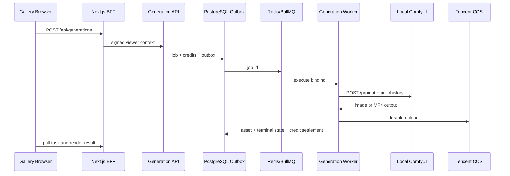

# Gallery 调用本机 ComfyUI：生图与生视频联调指南

本指南用于开发环境，把 Gallery 网站、Generation Service 和本机 ComfyUI 串成一条完整链路。生产环境仍必须使用受控 Worker、PostgreSQL、Redis/BullMQ 和腾讯 COS；不得让浏览器直连 ComfyUI，也不得把 ComfyUI 临时地址当成业务资产。

## 1. 架构与设计结论

- 生产网站：迁移 `0014` 中的本机 LTX 工作流默认禁用，不会自动影响线上流量。
- 可复用性：图片和视频都复用 Generation API、Provider Registry、队列、积分、审计、任务中心和存储。
- 成本：开发期复用本机 GPU；不新增微服务。最终文件仍进入 COS，避免本机磁盘成为业务事实来源。
- 小白维护：所有 Provider、模型和工作流都由服务端配置；前端只提交 `workflowSlug` 和白名单参数。
- 长期架构：ComfyUI 只是 Provider Adapter，重试、路由、计费、持久化和审计仍归平台服务。



## 2. 前置条件

1. PostgreSQL、Redis、Flask 主站、Gallery Web、Generation API、Dispatcher 和 Worker 可启动。
2. ComfyUI API 仅监听回环地址，例如 `127.0.0.1:8188`。不要把 8188 暴露到公网。
3. 生图 checkpoint、LTX diffusion model、CLIP、VAE 和 Video Helper Suite 节点已安装。
4. Worker 有最小权限 COS 凭据；密钥只放在未提交的 `.env` 或密钥管理器。
5. ComfyUI Python 依赖满足它自己的 `requirements.txt`。LTX 量化权重尤其要核对 `comfy-kitchen` 版本，不能只看“已安装”。

验证 ComfyUI：

```powershell
Invoke-RestMethod http://127.0.0.1:8188/history
Invoke-RestMethod http://127.0.0.1:8188/object_info/UNETLoader
Invoke-RestMethod http://127.0.0.1:8188/object_info/VHS_VideoCombine
```

预期：三个请求均返回 JSON；后两项包含对应节点定义。

## 3. Worker 环境变量

在 `services/generation-service/.env` 配置，不要提交真实值：

```dotenv
COMFYUI_BASE_URL=http://127.0.0.1:8188
COMFYUI_AUTH_TOKEN=
COMFYUI_HEADERS_JSON={}
COMFYUI_WORKFLOW_DIR=<仓库绝对路径>/services/generation-service/workflows
COMFYUI_DOWNLOAD_DIR=<受控临时目录>/comfyui-downloads
COMFYUI_DEFAULT_MODEL=<object_info 中存在的 checkpoint 名称>
COMFYUI_DEFAULT_STEPS=20
COMFYUI_DEFAULT_CFG=6
COMFYUI_DEFAULT_SAMPLER=euler
COMFYUI_DEFAULT_SCHEDULER=normal
COMFYUI_ALLOW_GLOBAL_INTERRUPT=false
GENERATION_POLL_INTERVAL_MS=1000
GENERATION_POLL_MAX_ATTEMPTS=3600
GENERATION_VIDEO_MAX_BYTES=209715200
```

`COMFYUI_DEFAULT_MODEL` 必须和 `/object_info/CheckpointLoaderSimple` 返回的值完全一致，包括子目录和反斜杠。视频模型由数据库 binding 控制，不能从浏览器参数覆盖。

## 4. 迁移与本地启用

先备份开发数据库，再执行 `0013_media_generation.sql` 和 `0014_comfyui_media_workflows.sql`。迁移只添加兼容结构和默认禁用的视频工作流。

在统一管理后台或开发数据库中，仅对本地环境完成以下启用：

- `comfyui` Provider 为 active；
- `comfyui-ltx-video-v1` workflow 为 enabled；
- 对应 binding 为 enabled；
- Mock Provider 不参与这次真实链路验证。

生产环境不得照搬本地启用状态。生产启用需要 Staging 验收、容量评估、内容安全、COS 权限和回滚审批。

## 5. 启动顺序

1. 启动 PostgreSQL 和 Redis。
2. 启动 ComfyUI，确认 8188 健康。
3. 启动 Flask 主站、Generation API、Dispatcher。
4. 最后启动 Worker，使它在启动时读取最新 Provider/binding 和 ComfyUI 健康状态。
5. 启动 Gallery Web，通过主站登录后打开 `/create`。

本机使用 `127.0.0.1` 时，Gallery `next.config.ts` 的 `allowedDevOrigins` 和登录回跳规则允许回环 HTTP；生产非回环地址仍只允许 HTTPS。

## 6. 端到端验收

### 生图

1. 在 `/create` 选择“生图 / 工作流”。
2. 输入 Prompt，选择尺寸、1 张、仅自己可见。
3. 提交后确认状态经过 `pending → running → completed`。
4. 验证 ComfyUI `/history` 有 `SaveImage` 输出、COS 有 `images/...` 对象、Gallery 页面显示图片、积分 reservation 为 settled。

### 生视频

1. 选择“生视频 / 本机 LTX 2.3 文生视频”。
2. 使用 960×544、5 秒，提交 1 个任务。
3. 验证 ComfyUI 队列出现任务并最终输出 VHS MP4。
4. 验证 MP4 为 24 FPS、121 帧、约 5.04 秒；COS 有 `videos/...` 对象。
5. Gallery 结果区出现带 controls 的视频，任务中心显示 owner-only 结果，积分 reservation 为 settled。

失败任务必须释放 reservation；不得直接修改任务为 completed。

### 快速冒烟（可选）

验证 API、队列、Worker、ComfyUI 与 COS 全链路时，可用脚本代替手工提交：

```powershell
cd services/generation-service
$env:SMOKE_USER_ID = "<测试用户id>"   # 该用户必须有足够积分
npm run smoke:comfyui
```

脚本会创建一条 5 秒私有视频任务并轮询到终态，成功后打印 COS URL 与积分结算。
可用 `SMOKE_API_BASE_URL` 指向 Staging API，`SMOKE_WIDTH/HEIGHT/DURATION_SECONDS`
调整参数；运行 `npm run smoke:comfyui -- --health` 只检查 API 健康状态。

## 7. 常见故障

| 现象 | 原因 | 恢复 |
| --- | --- | --- |
| `Value not in list` | binding/checkpoint 名称不在 ComfyUI 当前模型列表 | 以 `/object_info` 为准修正服务端模型名，重启 Worker |
| `Workflow placeholder seed is missing` | 请求未传 seed 且 Adapter 未生成默认值 | 使用当前 Adapter；它会为省略 seed 的请求生成安全随机值 |
| `NoneType ... Params` 出现在 `comfy/ops.py` | `comfy-kitchen` 低于 ComfyUI `requirements.txt` 锁定版本 | 停止 ComfyUI，按 requirements 安装精确版本，再重启 |
| 页面一直是加载骨架 | `127.0.0.1` 被 Next dev origin 检查阻止 | 保留 `allowedDevOrigins: ["127.0.0.1"]` 并重启 Next dev server |
| 登录后回到主站首页 | Gallery 或 Flask 丢弃本机 HTTP `next` | 两端仅对相同回环 origin 允许 HTTP；生产仍要求 HTTPS |
| COS 上传 `EACCES` | Worker 所在沙箱/防火墙不允许出网 | 在有 COS 出网权限的受控 Worker 运行；不要绕过持久化 |
| PostgreSQL 报参数类型推断不一致 | enum 状态参数同时用于文本判断 | 使用显式 `ai.job_status`/`text` cast 的当前仓库实现 |

## 8. 回滚

1. 在统一后台禁用 `comfyui-ltx-video-v1`；必要时禁用 `comfyui` Provider。
2. 等待运行任务终态，核对 reservation、ledger 和 COS 对象。
3. 停止本地 Worker 和 ComfyUI；恢复原 binding/model 配置。
4. 保留任务、账本、审计和已生成 COS 资产；不要清空 Redis 或删除数据库事实来“回滚”。
5. 代码回滚不删除 `media_type`、`generation_assets` 或既有迁移记录。

