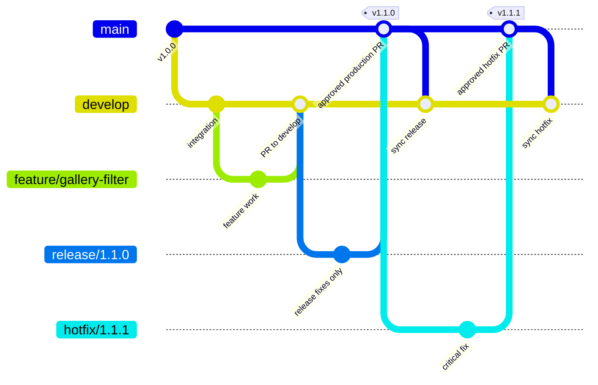

# 分支策略与分支图

## 分支模型



## 分支职责

| 分支 | 来源 | 合并目标 | 生命周期 | 谁可以合并 |
| --- | --- | --- | --- | --- |
| `main` | release/hotfix PR | — | 永久 | Release Manager，独立审批后 |
| `develop` | main 初始化 | — | 永久 | Maintainer，CI/评审通过后 |
| `feature/*` | develop | develop | 一个功能 | Maintainer，不允许作者自审 |
| `docs/*` | develop | develop | 一组文档 | Maintainer |
| `chore/*` | develop | develop | 一项维护 | Maintainer |
| `release/X.Y.Z` | develop | main | 一次发布 | Release Manager；只收发布修复 |
| `hotfix/X.Y.Z` | main | main | 一次紧急修复 | Release Manager + 独立 Reviewer |

合并完成后删除短期分支。`main` 合并后必须同步回 `develop`，避免修复在下一版本丢失。

## 日常功能命令

```bash
git fetch origin
git switch develop
git pull --ff-only origin develop
git switch -c feature/gallery-filter
```

预期输出包含 `Switched to a new branch 'feature/gallery-filter'`。完成并验证后：

```bash
git status
git add <明确文件>
git commit -m "feat(gallery): add visibility filter"
git push --set-upstream origin feature/gallery-filter
```

不要使用 `git add .` 盲目加入密钥或无关文件。`git status` 必须先人工确认。

## 常见错误与恢复

### 错在 main 上修改但尚未提交

```bash
git switch -c feature/short-description
```

工作区修改会保留到新分支。先确认 `git status`，不要 reset 或删除文件。

### 分支落后 develop

```bash
git fetch origin
git rebase origin/develop
```

只在自己的未共享分支使用 rebase。已经被多人使用的分支优先 merge，避免改写他人历史。

### 错误提交了密钥

立即禁用并轮换密钥，然后联系安全负责人清理 Git 历史。仅删除文件或追加 `.gitignore` 不能消除已泄露历史。
